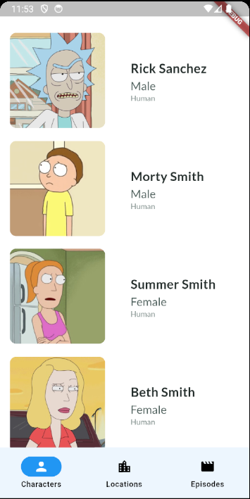
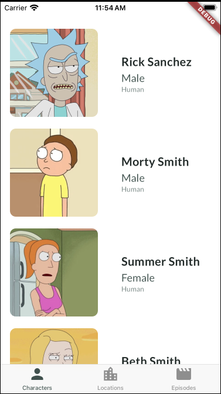

# Rick & Morty App

This is a simple app that shows information about the Rick and Morty TV show, built with Flutter.

## Automation

This project uses:

- [Makefile](Makefile): to have some handy commands like build autogenerated files and so on.

```bash
$ make
```

## Run Locally

Install dependencies

```bash
  flutter pub get
```

Generate files

```bash
  make generate_code
```

Start the app

```bash
  flutter run
```

## Screenshots

These screenshots showcase the user interface of our project.


*Character Page Android*


*Character Page iOS*
